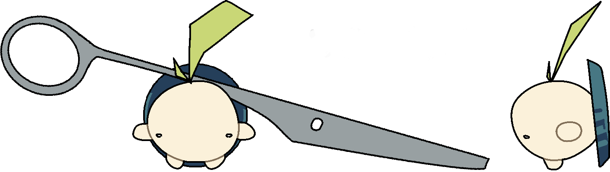
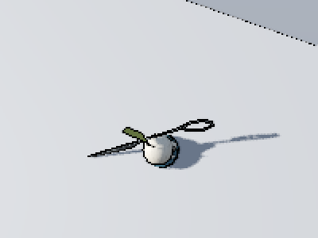
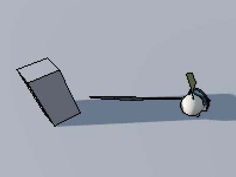
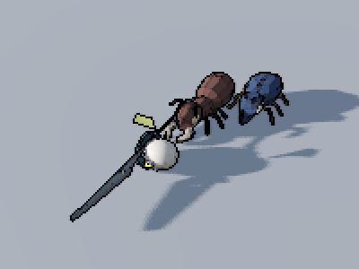
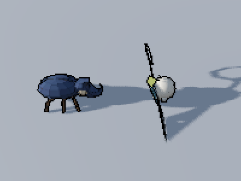
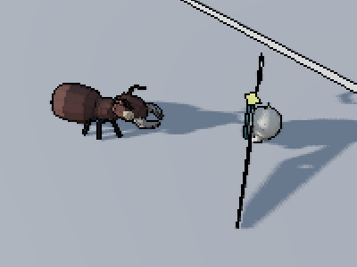
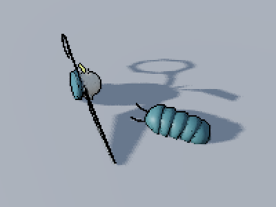
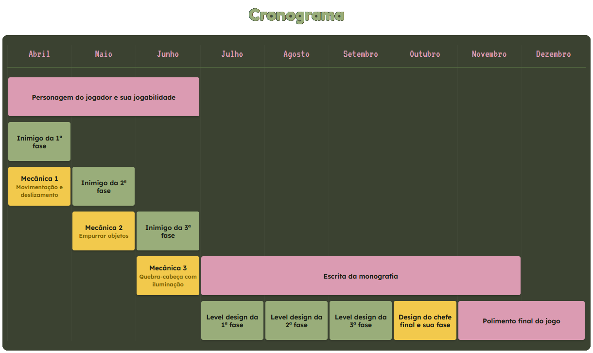

&nbsp; Guilherme Cunha
&nbsp; Diogo Ribeiro
&nbsp; Adriano Elias

---
<!-- _class: invert -->

# Aplicações de Computação Gráfica na construção de visuais estilizados, level design e jogabilidade para um jogo 3D

Explorar técnicas de computação para otimizar e desenvolver simulações físicas e efeitos visuais, que interagem com o ambiente renderizado em tempo real.

       A única matéria de computação gráfica oferecida no IME durante nossa graduação foi
                            Introdução a Computação Gráfica (MAC0420)

---

# <i class="fas fa-lightbulb"></i>&nbsp;&nbsp;Proposta

 

Jogo dividido em fases, cada uma com um objetivo diferente, que desafia o jogador a explorar o ambiente e interagir com os elementos do cenário para avançar.

         Ao progredir, o jogador encontra novas ferramentas para passar por obstáculos

---
<!-- _class: invert -->

# <i class="fas fa-cogs"></i>&nbsp;&nbsp;Habilidades e mecânicas

  

## <i class="fas fa-person-snowboarding"></i></i>&nbsp;Deslizar

## <i class="fas fa-person-walking-dashed-line-arrow-right"></i>&nbsp;Empurrar

## <i class="fa-solid fa-person-falling-burst"></i>&nbsp;Atordoar

---

# <i class="fas fa-skull"></i>&nbsp;&nbsp;Inimigos

  

## <i class="fas fa-bug"></i>&nbsp;Besouro

## <i class="fas fa-bugs"></i>&nbsp;Formiga

## <i class="fas fa-bomb"></i>&nbsp;Tatu-Bolinha

---
<!-- _class: invert -->
